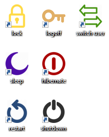

# win_desktop_icons

A batch/powershell script to create Windows desktop icons for shutdown, restart, hibernate, sleep, switch user, lock, and logoff.

Installation
----

Run the script _CHLLRSSS_install.bat

The install script will create a folder under '%USERPROFILE%\AppData\Local\chllrsss\' containing icon files.

Hotkeys
----

    logoff        CTRL+SHIFT+L
    lock          CTRL+SHIFT+K
    switch user   CTRL+SHIFT+U
    sleep         CTRL+SHIFT+S
    hibernate     CTRL+SHIFT+H
    restart       CTRL+SHIFT+R
    shutdown      CTRL+SHIFT+D
    control panel CTRL+SHIFT+C

Screenshot
----

