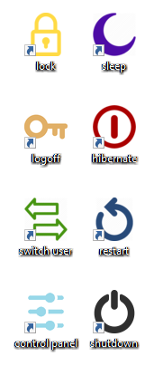

# win_desktop_icons

A batch/powershell script to create Windows desktop icons for shutdown, restart, hibernate, sleep, lock, and logoff.

The install script will create a folder under '%USERPROFILE%\AppData\Local\s_r_h_s_l_l\' containing scripts and icon files.

----

Hotkeys

    logoff    CTRL+SHIFT+L
    lock      CTRL+SHIFT+K
    sleep     CTRL+SHIFT+S
    hibernate CTRL+SHIFT+H
    restart   CTRL+SHIFT+R
    shutdown  CTRL+SHIFT+D

----

